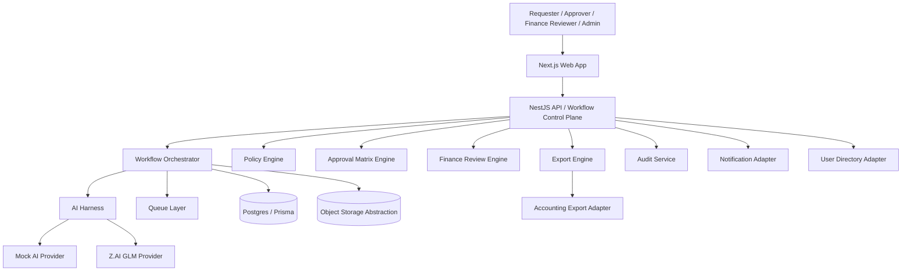
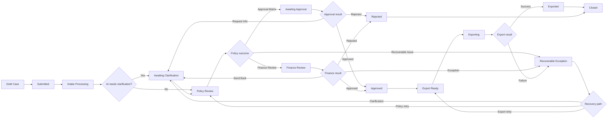
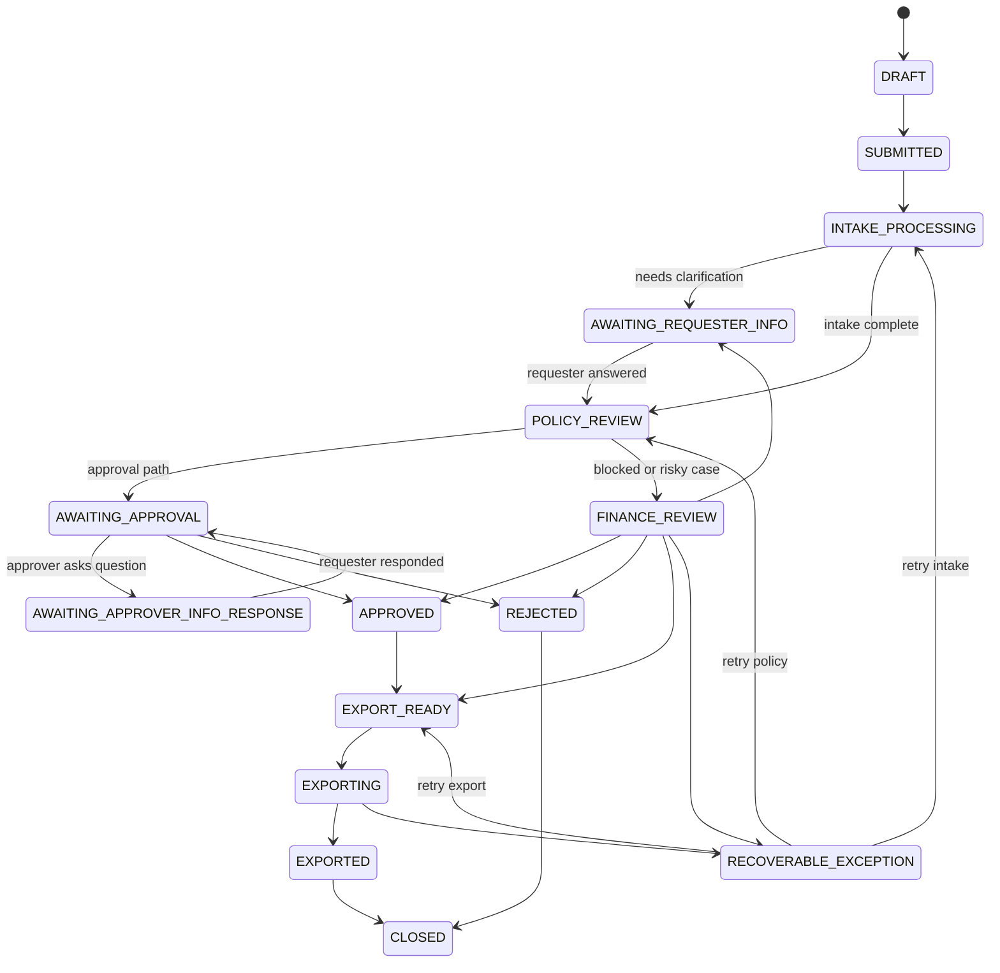
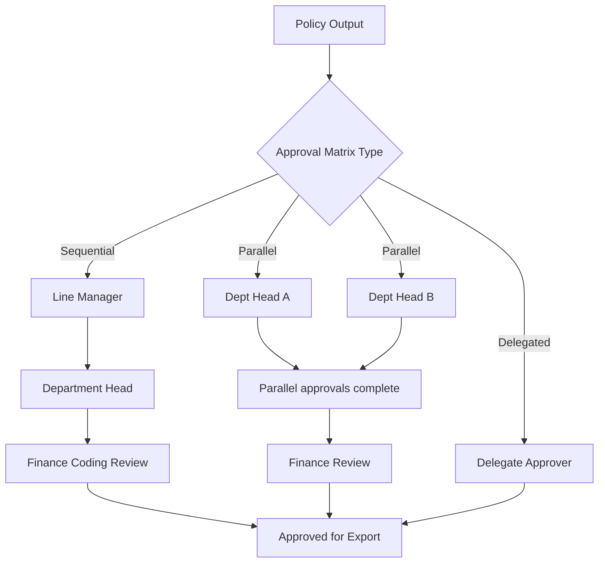

# Master Plan: SME Finance Ops Copilot

This document is the master implementation plan for SME Finance Ops Copilot. It supersedes the planning split previously spread across `implementation-plan.md`, `harness-prototype-plan.md`, and `more_details.md`.

## Summary
SME Finance Ops Copilot is a `case-first finance operations control plane` for messy inbound finance requests. Every request becomes a persistent case. AI proposes structure, clarification, and routing. Policy governs control outcomes. Humans remain in the loop for financially meaningful decisions. The case closes only when the result is auditable, reconciled, and export-ready.

This plan optimizes for `hackathon-first, scale-clean` delivery:
- deliver a convincing MVP quickly
- keep the modular monolith shape already present in the repo
- formalize the runtime around Harness-style stages
- support realistic finance controls now at the architecture and contract level
- fully polish only the most demo-critical workflow slice first

Success criteria:
- a requester can submit mixed notes and artifacts and the system creates a structured, stateful case
- GLM is visibly essential for extraction, clarification, routing, and rationale generation
- the UI shows the current stage, timeline, approval path, exceptions, and final normalized output
- the backend remains mock-first but production-expandable through adapter seams
- the platform can evolve into deeper finance operations without redesigning the core case model

## Product Thesis
The product is not a claims-only app, OCR utility, or chatbot wrapper. It is a finance workflow runtime whose job is to:
- capture evidence
- interpret ambiguity
- apply company controls
- gather the right approvals
- reconcile accounting truth
- export the final posting payload safely
- preserve a complete decision trail

The deepest product rule is:

`A case is not done when it is understandable. A case is done when it is controllable, reconcilable, and postable.`

## Architecture And System Design
### Core architecture
Use a modular monolith first, with clear boundaries that can split later if needed.

- `Frontend`
  Next.js case-management application for requester, approver, finance reviewer, and admin flows.
- `Backend API`
  NestJS service that owns case lifecycle, workflow orchestration, policy checks, approvals, finance review, exports, audit, and adapters.
- `AI Harness`
  GLM-powered service for intake understanding, structured extraction, clarification-question generation, routing recommendations, and short rationale summaries.
- `Persistence layer`
  PostgreSQL plus Prisma for cases, transitions, artifacts, extractions, questions, policy results, approvals, finance reviews, exports, admin settings, and audit events.
- `Queue / job layer`
  Inline execution for local simplicity, BullMQ-ready for worker-backed execution later.
- `Object storage abstraction`
  Mock-first now, Supabase-compatible seam already present.
- `Connector layer`
  Mock-first adapters for extraction, notifications, storage, accounting export, and future ERP or directory integrations.

### Architectural principles
- Use `case-first` design across every workflow.
- Treat AI output as `structured proposals`, never silent financial mutations.
- Separate policy logic from AI reasoning so rules remain testable and explainable.
- Make every stage auditable: inputs, extracted fields, confidence, policy outcomes, approvals, exceptions, and exports.
- Preserve mock-first adapters so the prototype runs fast while real connectors remain easy to slot in later.
- Model exceptions as visible workflow states, not background failures.

### Deployment shape
- MVP deploys as one web app, one API service, one relational database, and one storage layer.
- Queue execution can run inline locally and worker-backed later.
- Production roadmap adds managed auth, observability, secret management, stronger queue resilience, real connectors, and tenancy controls.

## Harness Execution Model
The official runtime model uses named stages. Service methods are executors inside this runtime, not the runtime itself.

### Stage definitions
1. `Intake Harness`
   Accept workflow type, notes, and artifacts; persist a case immediately.
2. `Extraction Harness`
   Process artifacts, extract usable text and metadata, and persist evidence.
3. `AI Reasoning Harness`
   Produce structured fields, confidence, provenance, open questions, and a recommended next step.
4. `Clarification Gate`
   Pause the case when data is missing, ambiguous, or disputed; resume after the requester or reviewer supplies evidence.
5. `Policy Gate`
   Apply company controls, required-field rules, duplicate detection, routing logic, reconciliation checks, and exception triggers.
6. `Approval Matrix Gate`
   Collect one or more business approvals using sequential, parallel, or delegated approval patterns.
7. `Finance Review Gate`
   Handle escalated, high-risk, blocked, or accounting-sensitive cases before export.
8. `Export Harness`
   create an accounting-ready normalized payload and hand off to export processing
9. `Exception Recovery Harness`
   recover from extraction failures, invalid AI output, duplicate suspicion, FX mismatch, tax mismatch, or export failure

For each stage the implementation should define:
- entry condition
- input contract
- output contract
- responsible service
- audit event requirement
- success transition
- failure and retry path
- owner when manual action is required

### System architecture diagram

## Product Scope
### Initial workflows on one shared engine
- `Expense claim`
- `Petty cash reimbursement`
- `Vendor invoice approval`
- `Internal payment request`

### Platform modules
The platform should be described and implemented through these explicit modules:

- `Claim & Case Management Module`
  owns case lifecycle, artifact viewer, timeline, transitions, assignment, and case detail surfaces
- `AI Extraction & Reasoning Module`
  parses messy inputs, extracts structured fields, generates clarification prompts, and supports FX estimation and reconciliation context
- `Fraud & Duplicate Detection Module`
  uses `EXTRACT` and `REASON` stages to identify exact duplicates, near duplicates, suspicious resubmissions, conflicting submissions, and anomaly signals before approval or export
- `Policy Engine & Configuration Module`
  owns routing rules, spend thresholds, required fields, reconciliation checks, and admin-managed policy configuration
- `User Management & RBAC Module`
  owns authentication, roles, organizational mapping, routing identity, and authorization boundaries for requester, approver, finance reviewer, and admin actions
- `Audit & Compliance Log Module`
  owns immutable recording of AI confidence, provenance, policy outcomes, human decisions, transitions, and exception handling
- `Report Generation & Export Module`
  owns finalized accounting payload generation, CSV or API export handoff, export status tracking, and lightweight operational analytics

### User roles
- `Requester`
  submits claims, invoices, or payment requests and answers follow-up questions
- `Approver`
  reviews, approves, rejects, or requests more information
- `Finance reviewer`
  resolves flagged, high-risk, policy-blocked, reconciliation-sensitive, or export-sensitive cases
- `Admin`
  manages policy configuration, routing rules, workflow settings, and connector readiness

### Core user-facing features
- role-aware workspace and sign-in shell
- case inbox with filtering and assignment views
- multi-artifact intake for notes, screenshots, receipts, invoices, and attachments
- artifact view with extracted text and processing status
- structured extraction and confidence panel
- clarification loop with explicit outstanding questions
- policy, anomaly, and reconciliation review panel
- approval workflow with comments, decision trail, and matrix visibility
- finance review queue
- export and resolution summary
- admin controls for policies, routing, thresholds, and connector settings

## Workflow Lifecycle And State Machine
### Lifecycle states
Use one canonical state machine across all workflows:
- `DRAFT`
- `SUBMITTED`
- `INTAKE_PROCESSING`
- `AWAITING_REQUESTER_INFO`
- `POLICY_REVIEW`
- `AWAITING_APPROVAL`
- `AWAITING_APPROVER_INFO_RESPONSE`
- `FINANCE_REVIEW`
- `APPROVED`
- `REJECTED`
- `EXPORT_READY`
- `EXPORTING`
- `EXPORTED`
- `RECOVERABLE_EXCEPTION`
- `CLOSED`

### Lifecycle meaning
- `DRAFT`
  case exists but has not entered processing
- `INTAKE_PROCESSING`
  system is extracting, reasoning, or preparing the case for controls
- `AWAITING_REQUESTER_INFO`
  the requester must provide missing, corrected, or reconciled information
- `POLICY_REVIEW`
  controls are being applied to determine routing, blocking issues, or escalation
- `AWAITING_APPROVAL`
  approval matrix is active
- `AWAITING_APPROVER_INFO_RESPONSE`
  approver asked a follow-up and the case is waiting on a response
- `FINANCE_REVIEW`
  finance is required to resolve policy, reconciliation, exception, or coding concerns
- `RECOVERABLE_EXCEPTION`
  the case hit a retryable or manually recoverable failure path
- `CLOSED`
  final terminal state after rejection or successful export completion

### End-to-end workflow flowchart

### Direct state machine diagram
This diagram reflects the canonical MVP lifecycle. Deeper approval logic, FX reconciliation, and tax validation happen *within* these states and gates; they do not introduce separate top-level states in the MVP state machine.

## Domain Model And Shared Contracts
Shared contracts should live in `packages/shared` first and be consumed by both `apps/api` and `apps/web`.

### Core entities
- `Case`
  id, workflowType, status, requesterId, assignedTo, priority, createdAt, updatedAt, currentStage, manualActionRequired, failureMode
- `Artifact`
  id, caseId, type, source, filename, storageUri, extractedText, metadata, processingStatus
- `ExtractionResult`
  fields, confidence, provenance, openQuestions, reasoningSummary, modelMetadata
- `PolicyCheckResult`
  passed, warnings, blockingIssues, requiresFinanceReview, duplicateSignals, reconciliationFlags, approvalRequirement
- `ApprovalMatrix`
  caseId, stages, routingReason, delegationRules, aggregateStatus
- `ApprovalTask`
  id, caseId, matrixStageId, approverId, status, decision, decisionReason, dueAt, delegatedFrom
- `FinanceReviewItem`
  caseId, reviewerId, outcome, note, reviewReason
- `RecoverableException`
  caseId, failureMode, ownerRole, summary, retryAction, lastTriggeredAt
- `ExportRecord`
  caseId, status, normalizedPayload, connectorName, errorMessage
- `AuditEvent`
  id, caseId, eventType, actorType, actorId, payload, timestamp

### Structured fields
The normalized field model must expand beyond simple amount and merchant extraction.

Required MVP-level shared fields:
- amount
- currency
- merchant
- invoiceNumber
- spendDate
- purpose
- costCenter
- vendorName
- projectCode

Architecture-level fields that must exist in the master plan now:
- originalAmount
- originalCurrency
- baseCurrency
- estimatedFxRate
- estimatedBaseAmount
- realizedBaseAmount
- realizedFxSource
- netAmount
- taxAmount
- grossAmount
- vendorTaxId
- amountDiscrepancyFlag
- taxMismatchFlag

### Public API surface
Expose stable backend APIs for:
- auth/session
- case creation
- artifact upload preparation and completion
- case submission and reprocessing
- case list and case detail
- clarification response
- policy review trigger and latest result
- approval actions
- finance review actions
- export trigger and export status
- admin policy and routing configuration

### Shared view models
The UI should consume explicit view models, not only raw DB-shaped responses.

Required additions:
- `stage` or `currentStep`
- `manualActionRequired`
- `failureMode`
- `recommendedAction`
- `reasoningSummary`
- latest policy result with reconciliation signals
- duplicate and fraud signals with reasoning summary
- approval matrix summary
- export readiness summary

## Deep Finance Controls
These controls are part of the system architecture and data model now. Prototype depth may vary by workflow.

### 1. Multi-tier and conditional approval matrix
Approval is not always a single approver. The model must support:
- sequential chains
- parallel approvals
- conditional approval tiers by amount, department, or workflow type
- delegation for out-of-office coverage
- optional finance coding review after business approvals

Approval matrix diagram:

### 2. Multi-currency and realized FX reconciliation
The system must support:
- merchant currency and base ledger currency
- AI-estimated conversion during intake
- user or finance-provided realized settled amount
- supporting evidence such as statement screenshots
- discrepancy handling when estimated and realized values differ materially

Policy should decide:
- when estimated FX is sufficient
- when realized settled proof is required
- when mismatch triggers clarification
- when mismatch requires finance review

### 3. Fraud and duplicate detection
Fraud and duplicate detection should be explicit, not hidden inside generic policy wording.

The detection model should work in three layers:
- `EXTRACT`
  collect duplicate and fraud signals from evidence such as receipt number, invoice number, merchant, vendor tax ID, amount, currency, spend date, project code, filename, OCR text, uploader, and artifact hash or checksum where available
- `REASON`
  classify whether the case looks like an exact duplicate, near duplicate, suspicious resubmission, conflicting submission, or likely legitimate separate claim
- `DECIDE`
  let policy determine whether to allow, warn, route to finance review, or raise a recoverable exception

Expected system behavior:
- exact duplicates should be strongly flagged
- near duplicates should generate reviewable warnings with rationale
- suspicious claims should route to finance review before export
- duplicate signals and reasoning summaries should be visible in the case detail and audit trail

### 4. Tax segregation and accounting normalization
The export model must support accounting-ready decomposition, not only totals.

Required checks:
- extract net amount, tax amount, and gross amount
- capture vendor tax identifier when available
- validate `net + tax = gross`
- if arithmetic fails, create a recoverable exception and route to clarification or finance review

## Workflow-Specific Behavior
### Expense claim
- flagship polished prototype slice
- demonstrate receipt intake, missing project code clarification, amount threshold routing, approval, export, and audit
- optional demo exception: FX or duplicate suspicion

### Petty cash reimbursement
- lightweight shared-engine workflow
- lower-friction evidence expectations
- may use simpler approval path unless thresholds or anomalies escalate it

### Vendor invoice approval
- invoice-number sensitivity
- tax extraction and validation are especially important
- finance review may be required for coding or tax inconsistency

### Internal payment request
- stronger routing controls
- policy may require cost center, project code, or approval tiers before export readiness

## Implementation Phases
### Phase 0: Master spec and alignment
- adopt this master plan as the single source of truth
- align terminology, stages, and diagrams
- confirm shared contract ownership in `packages/shared`

### Phase 1: Stabilize current prototype
- fix current build issues
- verify tests and build paths
- remove API and web payload mismatches
- confirm protected route behavior under mock auth
- confirm documented state transitions and queue behavior match implementation

### Phase 2: Formalize Harness runtime metadata
- add explicit stage metadata
- add manual-action-required metadata
- persist reasoning summary and failure modes
- expose better case detail view models to the web app

### Phase 3: Deepen finance correctness
- extend approval routing to matrix-aware contracts
- add FX reconciliation fields and clarification behavior
- add net, tax, and gross extraction plus arithmetic validation
- define recoverable exception categories and handlers

### Phase 4: Polish flagship demo slice
- fully polish one expense-claim scenario
- show clarification, threshold routing, approval, finance review, export, audit, and one exception path
- keep other workflows visible on the same engine with lighter specialization

### Phase 5: Broaden workflow nuance
- deepen vendor invoice and internal payment rules
- improve admin routing and policy configurability
- prepare real connector replacement roadmap

### Phase 6: Production roadmap
- replace mocks with real extraction, notification, and export connectors
- add SSO, RBAC hardening, stronger secret management, and observability
- add queue resilience, retry policies, and dead-letter handling
- add reporting, SLA tracking, and multi-tenant controls

## Non-Functional Requirements
### Security and governance
- RBAC on every case and action
- encrypted transport and protected storage
- PII-safe logs and redactable audit presentation
- immutable attribution for approvals and finance actions
- AI outputs cannot directly approve financial actions

### Reliability and performance
- submission returns quickly and background processing handles heavy work
- case list and case detail remain responsive during processing
- retryable steps are idempotent where possible
- connector failures degrade into visible workflow states, not silent loss

### Explainability and trust
- show provenance where possible
- show confidence and unresolved questions
- show short rationale for routing and flags
- preserve full decision chain for audit and demo purposes

## Test Plan And Acceptance Criteria
### Core happy paths
- expense claim with one receipt reaches approval, export, and close
- petty cash reimbursement completes on the shared engine
- vendor invoice approval completes with invoice extraction and export
- internal payment request reaches the correct review and export path

### Clarification and reconciliation paths
- missing project code triggers clarification and resumes correctly
- FX estimate is overridden by realized settled amount with supporting evidence
- tax mismatch triggers clarification or finance review
- approver request-for-info pauses and resumes approval correctly

### Approval matrix paths
- sequential two-step approval completes in order
- parallel approvals wait for all required approvers
- delegated approver can act when primary approver is unavailable
- rejection at any required approval stops export progression

### Exception and recovery paths
- duplicate suspicion routes to finance review
- artifact processing failure creates recoverable exception
- invalid AI output degrades to manual handling
- export connector failure transitions to recoverable exception and can retry
- unresolved reconciliation keeps case from export readiness

### Readiness gates
- every workflow type completes at least one happy path
- at least three exception paths are visible and recoverable
- audit trail exists for all state transitions and major gate decisions
- removing GLM materially worsens extraction, clarification, and routing quality
- demo reset is predictable with seeded data

## Assumptions And Defaults
- This master plan is the canonical build spec for the team.
- Harness is used as a workflow-orchestration and control-plane concept, not only CI/CD tooling.
- Multi-tier approvals, FX reconciliation, and tax segregation are architecture-level v1 requirements.
- The first polished prototype focuses deeply on one flagship workflow while keeping the shared engine broad.
- The current modular monolith remains the correct near-term architecture.
- Mocks remain acceptable for auth, storage, notifications, extraction, and export in the prototype.
- Human approval remains mandatory for financially meaningful actions.
- Mermaid diagrams are allowed and are part of the specification.
